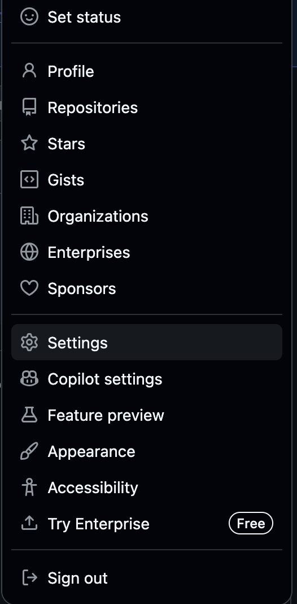
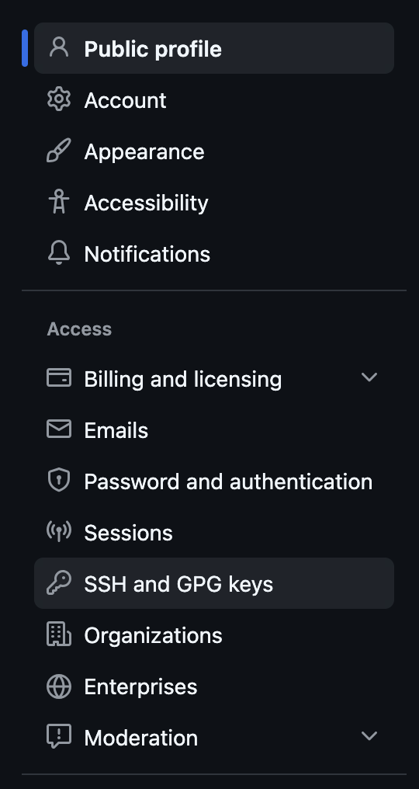
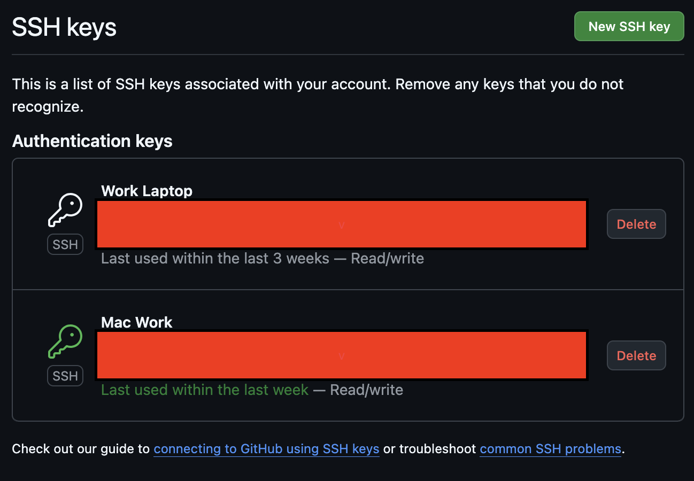
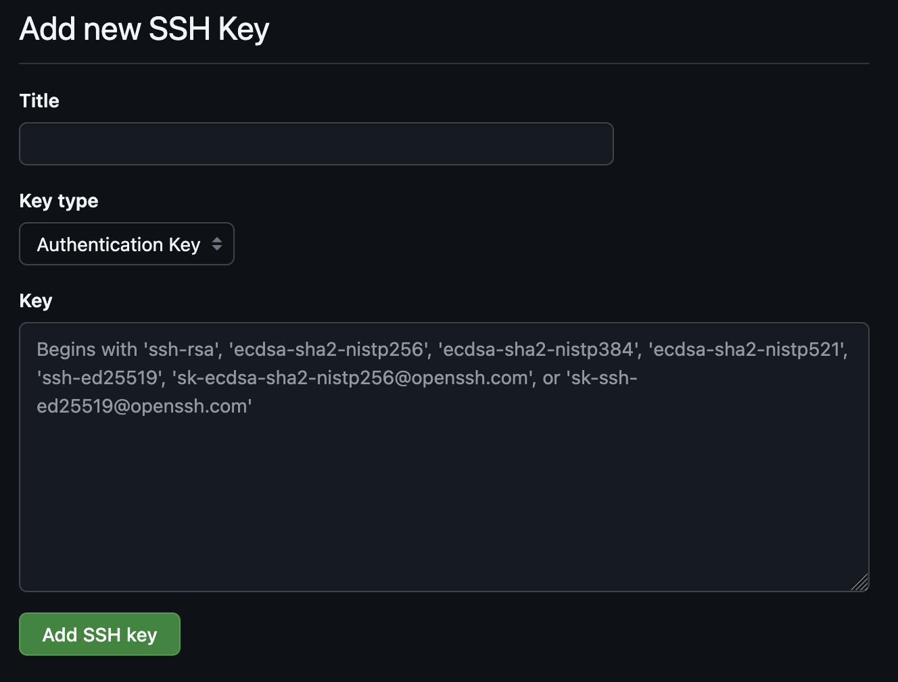
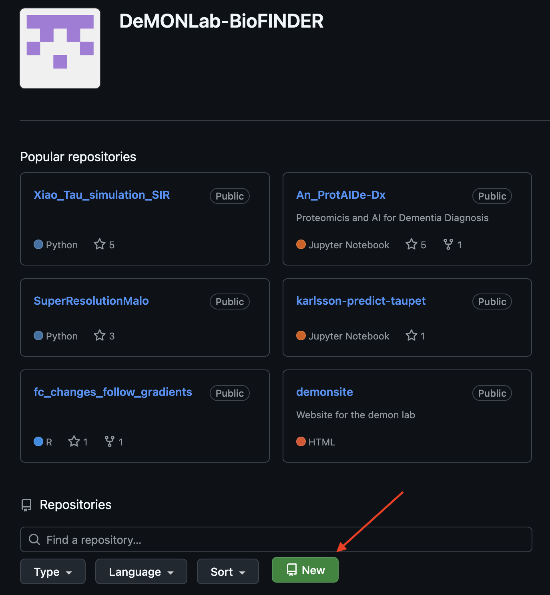
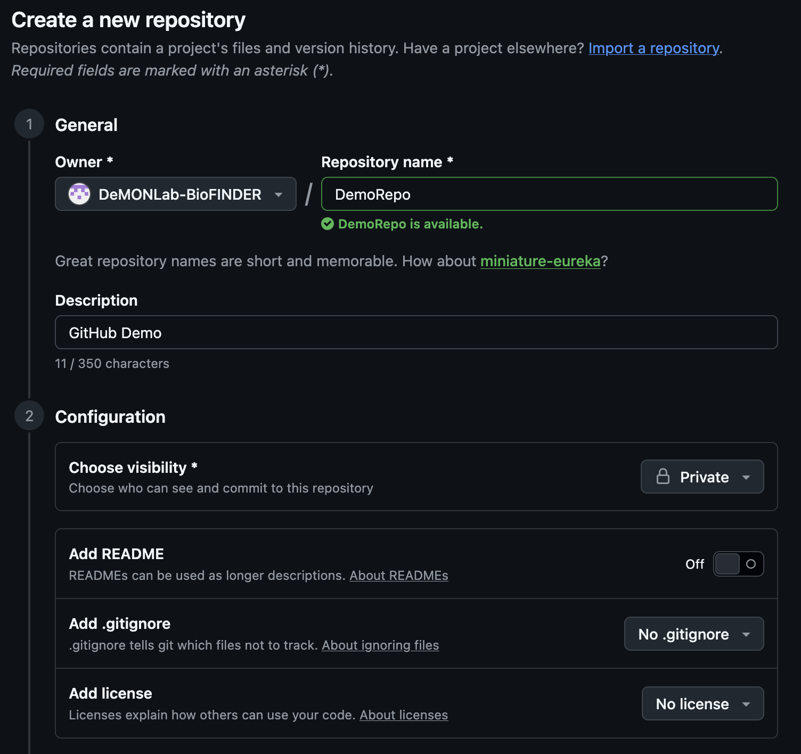
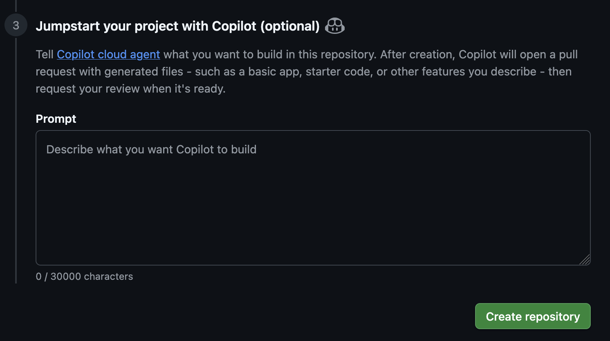
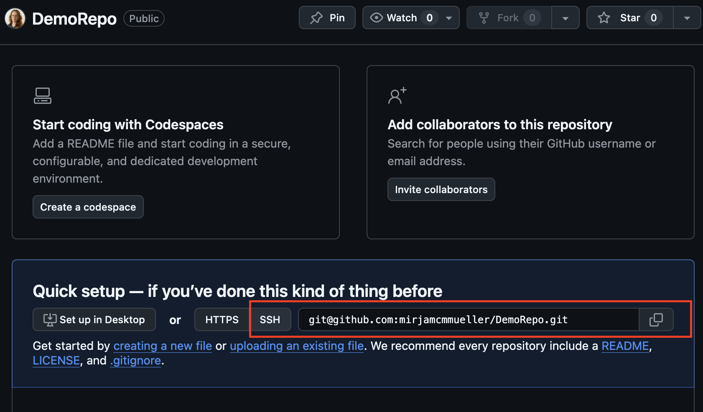

## How to Github - Demon Lab edition
*Mirjam Müller, April 2026*

*Disclaimer: This is supposed to help lab members get started with git/github or even just set up a repository on the demon github. I do not claim by any means that this file contains everything you can do with git/github. It is a whole universe waiting to be explored. But I am hoping it will give a thorough introduction and a place to get started or look up how to do something when you are lost. If you are stuck or find a mistake, please send me a slack or mail and I can update this file.*

*Old Git Documentation: The lab has previously provided Lab Git [Guidelines](Ch1.2_LabGitGuidelines(older).md) and a [GitWiki](Ch1.1_GitWiki(older).md). Some of the terminology is deprecated due to software updates, but check it out if you have time!*

## Table of Contents

- [1. Get started with git](#1-get-started-with-git)
  - [1.1 Installing git](#11-installing-git-if-you-do-not-have-it-by-default)
  - [1.2 Initializing a repository](#12-initializing-a-repository)
  - [1.3 The Working Tree](#13-the-working-tree)
  - [1.4 Staging Area](#14-staging-area)
  - [1.5 Local repository](#15-local-repository)
- [2. .gitignore/.gitkeep](#2-gitignoregitkeep)
- [3. Branches](#3-branches)
  - [3.1 Merge Conflicts](#31-merge-conflicts)
- [4. Getting started with Github: Remote Repositories](#4-getting-started-with-github-remote-repositories)
  - [4.1 Connecting github to git via SSH key](#41-connecting-github-to-git-via-ssh-key)
  - [4.2 Connecting to the DeMON page](#42-connecting-to-the-demon-page)
  - [4.3 A guideline for what to put on github](#43-a-guideline-for-what-to-put-on-github)
- [5. Two remote, one local](#5-two-remote-one-local)
  - [5.1 Everything goes to both remote repos](#51-everything-goes-to-both-remote-repos)
  - [5.2 Different content on different remote repos](#52-different-content-on-different-remote-repos)
- [6. Collaboration on Github](#6-collaboration-on-github)
  - [6.1 Shared repository](#61-shared-repository)
  - [6.2 External repository with a different owner](#62-external-repository-with-a-different-owner)

## 1. Get started with git
Any project exists in 4 spaces:
- The working tree
- The stageing area
- The local repository
- The remote repository
Very simply put, in different areas you can do different things. Section 4 covers the remote repository, the rest you find here.

### 1.1 Installing git (if you do not have it by default)
Mac OS comes by default with git, and there are several options available to install git. So use whatever works for you. If you are unsure, I would recommend using conda for a command line installation without admin permissions.

```shell
conda install anaconda::git
```
If you do not have conda on your computer already, check [here for installation help](https://www.anaconda.com/docs/getting-started/miniconda/install/overview).

### 1.2 Initializing a repository
To start using git, you need to initialize a repository in your project directory. This can be a directory you have freshly created, or it can already have tons of files in it. Initializing a repository will not harm the directory or its contents in any way.

```shell
git init
```

### 1.3 The Working Tree
In the working tree you edit and view the current versions of your files.
You can:
- Edit files
- Create new files
- Delete files
- Inspect changes.

Here you see what is happening before you save anything. 
To see which files git is tracking use

```shell
git status
```
It will show you which files are untracked, which files have been modified since they were last tracked and which files are up to date. When freshly initializing a repository, nothing will be tracked yet.

If you have committed a file before, diff shows you which lines in the file have been changed and how.
```shell
git diff
```
### 1.4 Staging Area
This is the place where you choose what you want to save (commit).
To add a file to the staging area use:
```shell
git add filename
```
When you use git status now, it will show you the file in green, showing that it will be included in the next commit. 
If you added a file to the staging area by accident, you can reverse it with:
```shell
git rm --cached filename
```

### 1.5 Local repository
A repository is a project that Git is tracking, including its full history of changes. What is the local history of my project?
When we want to save the changes in the stageing area to history, we use:
```shell
git commit -m "Put the text for your commit here"
```
Imagine a commit a bit like a snapshot of a project at a specific point in time. If you do not specify the -m and a text, git will ask you for one in command line before allowing you to move on.

If you, hypothetically, just comitted a file you did not want to commit (but not like state secrets or anything), you can use either again git rm --cached to untrack the file in the filetree, or if you want to remove it completely, use git revert.

To do this you need to first get the ID of the last commit.
```shell
git log
```
git log shows you the history of your local repository. You see all commits that have been made. It also shows you the last update tracked by each branch (see more on branches in section 3). You will notice that the last commit has HEAD with an arrow in parenthesis. The HEAD essentially shows you what commit and branch you are currently at. 

Then use the number to revert the last commit. We use a dummy ID a1b2c3d here.
```shell
git revert -n a1b2c3d
```
With git status you can now see that all files are returned to their previous status in the staging area. Note that this does not rewrite history, it just savely undoes the last commit with a new one. 
If you committed something you need to have removed from history, check section 2.

If you want to use git log to look at past commits and past versions of your files, you can inspect them using the commit ID. If you have a lot of commits, the --oneline flag helps you have a more compact clear version.
```shell
git log --oneline
#To just view history (safest) 
git show a1b2c3d
#You can also look at a specific file
git show a1b2c3d:cool_code.py
```
If you want to go back to an old commit to try something, for example to see if a script ran in a previous commit that is now bugged, then you can switch to the commit. Note that this detaches the HEAD. This is in itself not dangerous, but it is important to not make commits in this state as you might get tangled in history (like when you time travel and change stuff in the past and things get lost in history forever). 
```shell
git switch --detach a1b2c3d
#Try your stuff
python cool_code.py
```
If you realize "Wow, this script worked better in the past." and you want to go back to it, this is best done with a new branch.
```shell
git switch -c new_branch
```
Now it becomes a proper branch you can later merge into your master, but see more about that in the branch section 3.


## 2. .gitignore/.gitkeep
Often you have files in your directory that you do not want tracked by git such as for example data or your login information or just a bunch of random notes and papers. To tell git what you do not want to be tracked, you can use a .gitignore file.

In it, you list files or directories you do not want tracked. This works by name but also by file extension. F.e.
```shell
password.txt
super_secret_stuff.docx
Literature/*
Data/*
*.pdf
```
This would tell git to not track the password file, the super secret stuff and also nothing in the directories Literature and Data, and lastly, no pdf files. 

You can also use this in reverse. I often do this when I have all files for a project in the same folder and what I want synched is less than what I do not want to have synched.
For example:
```shell
#Ignore everything first:
*

#Then list things we want tracked as exceptions
#I want to put my first step of the analysis on github for example
!/1_FirstStepOfAnalysis

#Additionally I want to allow all script types relevant for my project
!*.py
!*.R
!*.md
!*.sh
```
Now when I choose to add everything to the stageing area, it will ignore everything but what I have specified.

Should you have committed something that should not have been tracked, like super secret stuff, you will have to reset history.

```shell
#if not pushed yet.
git reset --soft HEAD~1
```
Unlike revert, this DOES change history. Only use it when you absolutely have to. 

If you have already pushed it to github, immediately inform everyone that is concerned. I.e. owners of the data, administration of the server to which you just pushed the login etc. Then change what you can and remove it from your github immediately. 
```shell
git filter-branch --force --index-filter \
"git rm --cached --ignore-unmatch secret-file.txt" \
--prune-empty --tag-name-filter cat -- --all
#Force push to remote
git push origin --force --all
```
This is an absolute last resort (and I have to be honest, I have not tested it but have it from back when I learned github as a master student), but it essentially cuts the last commit from whatever branch you are on at the moment and force pushes the change to remote.

By default git does not track empty directories. Should you want an empty directory to be part of your repo (local or remote), you can achieve that by going into the empty directory and adding a .gitkeep file. It is enough to touch it, no need to put anything in it. See an example below of how this looks in the terminal, to make sense of it:

```shell
(base) GithubDemo % mkdir Directory
(base) GithubDemo % ls
Directory		README.md		other_test_file.txt	test_file.txt
(base) GithubDemo % git status
On branch master
Your branch is up to date with 'origin/master'.

nothing to commit, working tree clean
(base) GithubDemo % cd Directory 
(base) GithubDemo % touch .gitkeep
(base) GithubDemo % cd ..
(base) GithubDemo % git status
On branch master
Your branch is up to date with 'origin/master'.

Untracked files:
  (use "git add <file>..." to include in what will be committed)
	Directory/

nothing added to commit but untracked files present (use "git add" to track)
```
## 3. Branches
Branches can be a bit intimidating at the start. But essentially you can imagine them like pointers to a specific commit. The branch you work on by default is the master branch, sometimes also called main branch. You can see that in git status, but also specifically with git branch.

```shell
#Tells you what branch you are on at the top of the output
git status
#Shows you all branches, marked with a star where you are
git branch
```
Branches are useful for a lot of things. For example if you have an analysis pipeline that is working, but you want to try out something without breaking the whole thing? branch. You want to work on a project with another person but want to avoid overwriting what they have done? branch. You want to go back in time and try something out on an old version of a file and then save it? branch. You can do a lot of cool stuff with branches. To create one, you just give it a name.

```shell
#Create a branch
git branch "new_branch"
#Switch to your new branch
git switch "new_branch"
#Now git status will show you that you are on the new branch
git status
#If you want to see all branches in your repo, and where you are use git branch.
git branch
#Use the -a flag to also include remote repository branches
```
Changes you make and commit while on a branch are not saved in your master. If you switch back to your master, you will find the files unchanged. You can see with git log, what the last commits are for each branch.

If you like a change you have made to a branch and you want to add it to your master branch, use merge.
```shell
#To merge a branch into the branch you are currently on f.e. master
git merge new_branch
```
When you look at the history with git log now, you will see both the new branch and your masters are back together at the same commit.

### 3.1 Merge Conflicts
Sometimes when we try to merge a branch with the master, it can come to a merge conflict. Maybe you (or someone else) worked on the same script (f.e. cool_code.py) on the master branch too and now you have two conflicting newer versions of the file you are trying to merge. This can look like this:
```shell
(base) GithubDemo % git merge new_branch
Auto-merging cool_code.py
CONFLICT (content): Merge conflict in cool_code.py
Automatic merge failed; fix conflicts and then commit the result.
```
When this happens, git actually rewrites your file to show the differences. This can look something like this:
```shell
<<<<<<< HEAD
print("This is the version from master")
=======
print("This is the version from new_branch")
>>>>>>> new_branch
```
It shows where your current branch (master) with <<<<<<<<< HEAD, then it has a separator ======= and finally it shows the incoming changes from new_branch >>>>>>> new_branch. 
You then can manually edit it to keep the version you want and finally add and commit that version.

If the script is rather big or it concerns several, it might be good to investigate the conflicts more closely:
```shell
#To see which files are conflicting
git status
#To see the differences in scripts, that will show you only the conflicting sections
git diff
#To compare branches directly (before merging)
git diff master new_branch
#To show the versions on the different branches
git show HEAD:cool_code.py #or git show master:cool_code.py, it produces the same if you are on master.
git show new_branch:cool_code.py
```
If you do not want to edit it manually, you can also choose which one you want. 
```shell
#To choose the current branch version (master in our case)
#Remember that this requires us to be on the master branch though!
git checkout --ours cool_code.py
#To choose the incoming branch version (new_branch in our case)
git checkout --theirs cool_code.py
```

## 4. Getting started with Github: Remote Repositories
To share your work with the world (or just other lab members), you can connect your local repository to a remote repository (preferably on the demon lab page).
To do this, you will have to set up an ssh key connection between your git and your github account. This is covered in the [next section](#41-connecting-github-to-git-via-ssh-key). If you already have this done, [go straight to 4.2](#42-connecting-to-the-demon-page).

### 4.1 Connecting github to git via SSH key
If you do not have an ssh key on your laptop yet (they would be at ~/.ssh), you can generate one when in your home directory with:
```shell
#Generate ssh key
ssh-keygen -t ed25519 -C "your_email_for@github.com"
eval "$(ssh-agent -s)"
ssh-add ~/.ssh/id_ed25519
cat ~/.ssh/id_ed25519.pub
```
To let github know that this is your ssh key, you will have to copy the contents of the .pub file to your github settings.
You open the settings by clicking on your profile picture on the right top corner when on github:



Then you go to SSH and GPG keys:



You can see the ssh keys you have added for your github there (blocked out for obvious reasons) as well as add new ssh keys on the top right (green button):



When you click add a new key, this opens:



You can give it a name and then paste the contents of your .pub file into the box below. 

To let github know who you are, you also need to configure your git user on your laptop:
```shell
git config --global user.name "your_username_on_github"
git config --global user.email "your_email_for@github.com"

#Check if it worked!
ssh -T git@github.com
```
All set to go!

### 4.2 Connecting to the DeMON page
It is finally time to make a github repository for your project!
For this you need to go (preferably) on the github demon page and click create repository.
Here you will specify the configurations for your repository, such as giving it a name etc. I would recommend not adding a README or any file automatically, as you want the repository to be empty to easily connect it to your local repository. If you have work in progress that you are not ready for the world to see, then put the visibility to private. Note that other members of the lab can still see those repositories.

Here is how this can look like:

Click the new repository button on the demon lab's github page:


Add a name and description to your new repository. Do not add any files yet, if you want to connect it to your local repository.




Once you have set up your repository, it will be empty but have a field in the middle of the screen to copy the ssh address. Like this:



Copy the ssh address and go back to your terminal.
You will now add this as a remote repository to your local. If you already have a remote repository connected to your local repository, skip this part and go to [section 5](#5-Two-remote-one-local) directly!

```shell
git remote set-url origin git@github.com:DeMONLab-BioFINDER/DemoRepo.git
#check that it is correct
git remote -v
```
Now you can sync your local repository with the remote. Sending all of your files and current versions to the remote repository is called "pushing". Downloading stuff from your remote repository is called "pulling". So if you want to push your local repository now into your empty remote repository, do:
```shell
git push origin master
```
To push your master branch to the remote repository.

If you want to save this information so git knows you will always push to origin from master, you can save it with:
```shell
git push -u origin master
#or explicitely
git push --set-upstream origin master
#They do the same thing.
```
After this, when you do git push, it will always push from master to origin. 

Now you are all set up to go! Your daily flow then looks like this:
```shell
#You made changes in your files
git add . #to add all changed files (or name them explicitely)
git commit -m "Describe your changes here"
#Now it is saved in the local repo
git push
#Now it is saved on github as well
```
If you make a change on github, like for example making a README because it has a nice preview function, and you want to sync your local repo with the remote, you pull instead.

```shell
git pull origin master
```
And now both repositories are up to date again and you can see the README in your local files as well.

### 4.3 A guideline for what to put on github
*Note that this section specifically is just what I believe and know. Different people do it differently. But this is not supposed to be seen as absolute laws, but more so as guidelines for what is a good idea.*

To make a successful and good github repo, there is one thing to keep in mind: A github repository is supposed to contain all information needed for someone to be able to reproduce your analysis (or pipeline etc. But for simplicity sake I will keep using analysis throughout this section. The idea is the same either way.). 

As long as you fulfill this criteria, you are already mostly there. This means not only that you upload all scripts and commands needed for your analysis, but that you also document them well and have a README. It is important that the repository is structured and documented in a way that a new user understands it without you sitting with them to explain it. If you are unsure if your repository does this, ask a coworker that is not familiar with your project to take a quick look.

You should upload:
- A main README on the repository's starting page
- all scripts used in the analysis
- parameter files as necessary (if made by yourself).
- screenshots/flowcharts as necessary

#### README
The README is supposed to introduce and walk a new user (or friend or reviewer) through your repo. This means you include a quick description on top. It also means you include a step by step rundown of the analysis and where the user can find what on the repo if you have subdirectories. A README for a smaller repository can contain all steps and commands to run the whole thing in itself, f.e. say I first ran this script in command line with this command, then I run this one on the output etc. It is important to always state what the input and output files are for everything you run, what you will use for the next step, what you are using from a previous step as well as listing all package and software versions (this includes R or python base version).

Imagine it almost like a tutorial for someone that approaches your repository for the first time. Note that all information should be given general. Avoid hard coded paths etc., because another person's computer will look differently. Instead tell the user where to insert their own file path or let them use it as an input to the script/software they need to run. If you follow a pipeline with different softwares that have fixed output file names (either because you coded them like this or because the external software does), it is also okay to use those, but again mention it in the README.

So, to sum it up for the README:
- **The README includes every piece of information to run your analysis, including all version numbers and packages.**
- **Avoid hardcoded paths and files when you can.**
- **Whether you can avoid them or not, include instructions for files and paths in the README.**

If you have a long analysis, it might make sense to have subdirectories in your repository and write short README's for each subdirectory to avoid making your main one cluttered and too big. In that case your main one can skip the detailed step by step but instead point to the subdirectory's README for this particular part. Note that a README has to be called README in order for github to display it previewed for a directory on your repository.

#### What not to upload
Do not upload any data, confidential or otherwise. If confidential/sensitive it is self-explanatory, but even if it is not, don't upload it because it will take a lot of space on the repository and slow things down. Instead state in the README what data you use and if it is publicly available you can include information on how to get it. The same goes for database files such as genome annotations from GENCODE/RefSeq etc.

Do not upload any login data or passwords.

Do not upload files that are not needed for your analysis. Literature for example, or notes you took for yourself, they are not needed for someone to run the analysis and as such should not be included in the repository as they will only confuse the user. If you use an external software, you can link their webpage/github or even their paper in your README.

#### !!! Should you accidentally upload something confidential, fix what you can and then IMMEDIATELY notify all parties involved. !!!

Even if the files are no longer on your github, they were for a while and as such you are obligated to inform anyone involved. I will name a few examples here, but of course the list is more comprehensive. It is up to you to decide who you have to inform. If you are unsure, talk to Jake about it.
- If you leak confidential data, it is important you notify the cohort.
- If you leak a login to a server, it is important you change it immediately and notify the admins of the server.
- If you leak passwords for the lab or something similar, immediately inform Jake.

It happens, and most of the time it can be fixed and nothing bad happens. But it is very important that you come forward immediately if something happens, rather than keeping it a secret because you are afraid or think nothing will happen anyways. If found out later, or if it leads to a data breech or something similar, the fallout will be way worse.

## 5. Two remote, one local
Some of you might say that you do not need the world (or your coworkers) to see your every script in process. Maybe you would rather only push to the demon github what is already finished and use your own github repository for everyday version control. Maybe you already have a remote personal repository set up to your project repository and need to set up a separate, additional connection for your demon lab repository. 

This section is for those people. It shows you how to connect two remote repositories to the same local and how to navigate pushing, so nothing ends up in the wrong place. 

After creating your demon page github repository, you copy the ssh address and go back to your terminal. Instead of setting the url, you instead add an additional remote.

```shell
git remote add group git@github.com:DeMONLab-BioFINDER/DemoRepo.git
#Check your remotes
git remote -v
```
The new remote repo is now called "group", change the name as you like. In general the idea is to push all changes to the demon lab repo. But I also know, that for some people they would rather only push to the demon lab page what they feel is "ready" and save the rest in their own personal repo. So, there are two subsections for this part. 

### 5.1 Everything goes to both remote repos
The easiest way to solve the "two remote repo" issue is to always specify where you push and always push to both. This specifically means:
```shell
#Push every day changes to personl (in this case origin)
git push origin master
#When "ready", also push to group
git push group master
```
This way, all your changes and files always go to both repos and the two remote repos look the same at any point in time.
Note that in this case you cannot save the upstream with -u, because a branch can only have one upstream remote repository. So you do have to specify this explicitely every time.

### 5.2 Different content on different remote repos
If you want to be more selective with what you push where, you can do this as well with pushing from main to group whenever you have something feel is ready. But even better would be creating two separate branches for the two separate repos. Say you want to send everyday changes to your own repo, so you push master to origin. But you only want "ready/working" changes on the group's repo. Then you can create an extra branch for the group like so:

```shell
#create a branch named shared, this has all commits we want on the groups repo
git branch "shared"
#When you are on a state on your master that you like to share:
#Switch branches
git switch shared
#Make a commit here
git add .
git commit -m "Add finished changes of step X of analysis to shared"
#Push it to the group repository, it is okay to save this, since you wont push the same branch to your personal
git push [-u] group shared
#Push master to your personal
git push [-u] origin master
#Now when you are on the master branch, and do git push, it will push to origin,
#If you are on the shared branch and do git push, it will push to the group.
```
Now it is set up that it will work automatically depending on what branch you are on.

Don't forget that when you made changes to main and are ready to share them, you'll have to switch branches and merge it with your shared, so your shared also adapts the "ready" changes.

```shell
git switch shared
git merge master
#Now we can push from here to the groups repo
git push
```

## 6. Collaboration on Github
Github allows for several people to work on the same projects together. Each of them can pull files from a project repository, work on their own machines and then push them back to the repository. However, collaborating (especially when done on larger projects) comes with its own set of challenges and terms. 

There are in general two scenarios in which this might happen. So we will have two different sections for them:
- You and other members of your group work together on the same repository
- You contribute to an open-source repository or collaborate with someone external

### 6.1 Shared repository

#### Simplest Way (not recommended)
The most simple way of collaborating with someone from the group on a repository is following these 3 steps:
1. You pull, to get the latest changes before you start working.
2. You do your work locally and commit them locally.
3. When you are done for the moment, you push your changes.

Your push can fail, if someone else pushed their changes before you have. In this case you can do a pull, specifically one with rebase:
```shell
git pull --rebase
```
It pulls the new commits from the other member, and then applies your work on top. If you worked on different files, this will go automatically and you can push immediately after.

However, if you worked on the same file, you will get a merge conflict during the rebase (see also [section 3.1](#31-merge-conflicts), but you resolve it slightly different than what we have done before. 

If you look at the conflicting files manually and see immediately that it is minor differences and you can fix it, go ahead and do it manually. Then do
```shell
git add problematic_file.py
git rebase --continue
```
If you are unsure which version is better, or want to talk to your coworker about it first (recommended), stop the rebase.
```shell
git rebase --abort
```
Then you can go through the differences together.

Note that doing a rebase does not delete your changes. Git just pauses and asks you to resolve differences before applying them to your coworkers version.

#### Better practice (recommended)
Each of you works on a different branch, neither on master. The workflow then looks like this:
1. Switch to the master branch on your local version of the repository
2. Pull
3. Create your own branch.
4. Work and commit normally, locally.
5. Then push your branch
6. You can then either do a pull request (recommended) which allows your coworkers to review your code and merge it into main, or you can do a local merge by switching back to the master, pull, merge with your branch and then push.

If you want there is an optional last step:
7. Clean up after merging, by deleting your own branch.

### 6.2 External repository with a different owner
When you do not have writing access to the original remote repository, or you want to work independently, the workflow looks different. In this case you have to "fork". A fork is essentially your own personal copy of someone else's repo on github. 
1. Click fork on github
2. Clone your fork in your terminal to work on it locally
```shell
git clone git@github.com:yourname/repo.git
```
If you have made changes to your fork and you want to suggest to the owner of the original repository to implement them, you do a pull request. It is essentially saying "Please, add my changes into your repository.".
How you do this, is to make changes in your fork and when you are ready, push them to your fork. Then on github you click on "New Pull Request".

Now the owner can review your code, comment it, approve it and merge it as they seem fit. If the owner of the repository accepts your pull request, the changes will be implemented in the original repository.


