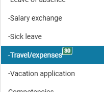
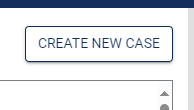
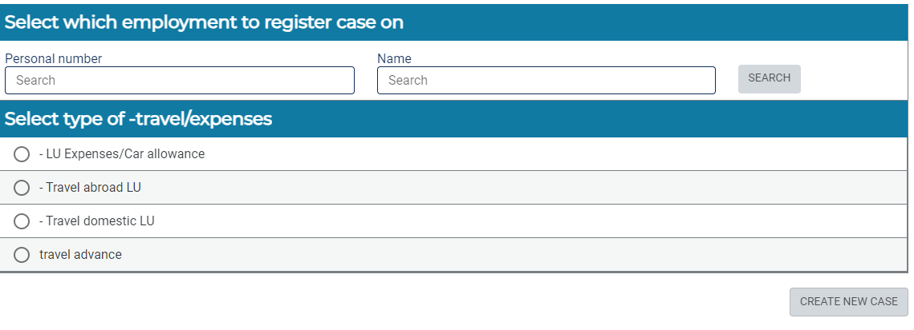

---
tags:
  - lab_maintenance
created:
  - 2024-Nov-07 11:07
aliases:
  - Git Wiki
---
# Reimbursements

In cases where you had to pay for something out of pocket (i.e. travel, hotel, other goods for the lab) you can apply for reimbursement via Primula.

1. Go to Primula
2. Click on Travel/expenses in Primula on the left side 

For reimbursement of things like travel tickets, conference fees etc chose an option _LU expenses/car allowance_. Travel abroad is only when you are going to have allowance.

3. Create new case  

4. In general: 
	- add Cost center (in search bar just type in 'Vogel')
	- in activities add grant code (again just type in 'Vogel', all available ones will pop-up)
	- drop the files you want to send in with the case (i.e. receipts etc.)
5. International expenses (also domestic expenses):
	- Fill out the required fields 
	- For international expenses use their suggested currency converter to calculate the exchange rate [link](https://www.oanda.com/currency-converter/en/?from=EUR&to=USD&amount=1)
6. Submit:
	- Check extra pay if you want the reimbursement made separately from the paycheck, otherwise it will arrive together with your salary
	- Calculate - this calculates the payout, check that the sums are correct
	- Print the overview page in Primula
7. Mail the papers:
	- ___SUPER IMPORTANT:___ _all_ receipts and relevant documents (and case overview page you've just printed) must be mailed physically to kansliet. 

__Other notes:__
- Marika Bergman <marika.bergman@med.lu.se> has been handling our reimbursement cases (as of date 2024, Nov), and has been super helpful with any issues and questions.

- To reimburse others: the applicant has to apply for access to be able to do reimbursement for others.
	- Either HR person can fill in the application for you, or potentially can fill out yourself in Lucat
		- IT-tjänstgrupp - HR
		- IT-tjänst - Primula
		- Behörighet - Källrapportör
- Then with that specific access will be able to register the reimbursement for other employees.  
  

_note:_ to reimburse complete randos from outside or ex-students you need to use another form _Taxfree reimbursement for personal costs_. The form then needs to be sent to the Division of Finances. Just fill out the form and attach the receipts and documents. 
 
[all forms (in swedish)](https://www.ekonomiwebben.lu.se/mitt-arbete/overgripande-om-ekonomi-och-redovisning/blanketter#Kostnadsersattning) 
 
[another link to some swedish form](https://www.ekonomiwebben.lu.se/sites/ekonomiwebben.lu.se/files/2024-04/rutiner-vid-ersattning-av-personliga-utlagg.pdf)
