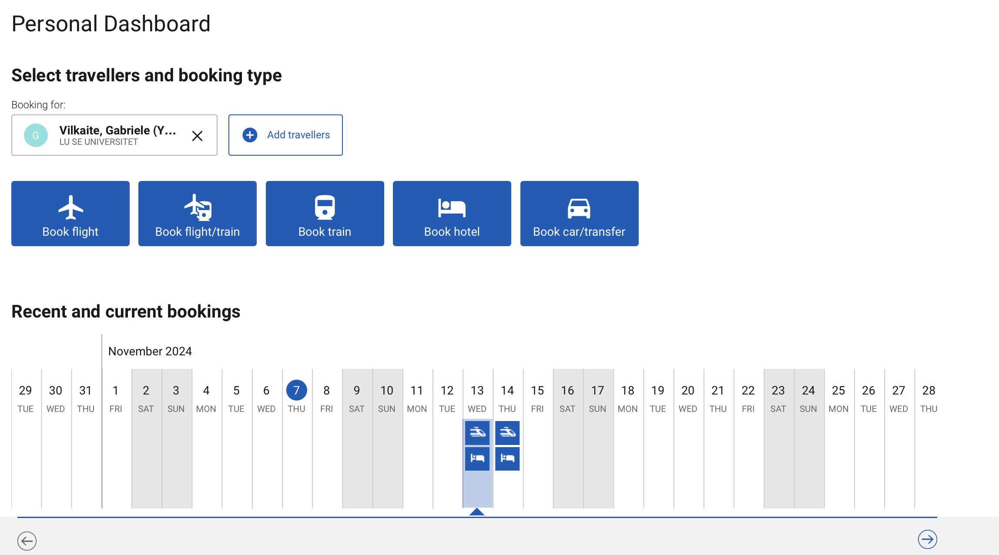
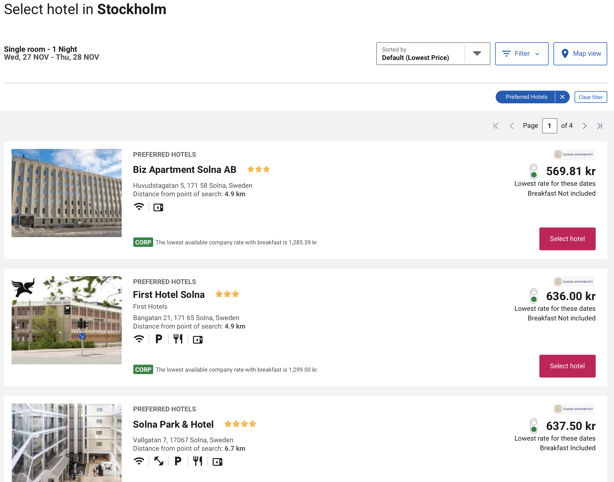

---
tags:
  - lab_maintenance
created:
  - 2024-Oct-25 09:31
aliases:
  - Git Wiki
---
# 1. Lucat 
### ask for permissions to book travels on your account
You need an entitlement in Lucat in order to be able to be able to book travels for yourself (and others) via BCD travels. You can request the needed entitlement in Lucat by following these steps:
1. Go to lucat.lu.se in your web browser and login. 
2. Click on My entitlements under My page on the left hand side, and then click on Request an entitlement. 
3. Select the Type of entitlement as IT service. 
4. Select the following: 
	- IT service group (IT-tjänstgrupp): Infrastruktur 
	- IT service (IT-tjänst): Resebokning 
	- Entitlement (Behörighet): Resebokare (this will allow you to book trips for others as well)
# 2. Cytric booking system

To get to Cytric system (the one you will use to book trips), just either:
- Google something like 'travel book lund uni'
-  -or- go to this staff page: [link](https://www.staff.lu.se/support-and-tools/business-travel/how-book-trip)
- -or- go directly to the source [cytric booking system](https://resebokning.adm.lu.se/)

### Book the trip
Here you will find your own personal dashboard, showing:
- Your or other's upcoming trips
- And things you can book

#### If you want to book the trip for yourself...
just continue with booking for: your own name and that's it

#### But if you want to book a trip for someone else...
press Add travellers button, fill out this form and continue:
 

### Book flights 

Quite straightforward, find a flight that suits you best and select it.

___NOTE:___ pay attention to:
- Are the tickets refundable or not (sometimes they automatically suggest you buy refundable tickets which are significantly more expensive) This often shows up in step 3 "Select Fare"
- Do the tickets include baggage or not (often it does, but if it doesn't you can always add it on as an extra for a price)

### Book trains
Do not recommend for international travel (may be a bit tricky), but is great for travel within Sweden.
Booking process almost identical to flights booking.

### Book hotels

Again, just select where to go and dates, press Search

And you will get either a list or a Map view of the hotels, select the most optimal one.

At Step 3 "Select Room" you will be most likely given at least two room options, with completely identical descriptions of what you get, but different prices, usually because of different cancellation policies.

Then just continue onwards to the booking.

# Points of contact 
Email BCD.travel if you have any questions. If there's any issues with accessing the system and what not, they can usually book the trip for you as well if that's something that you need.
