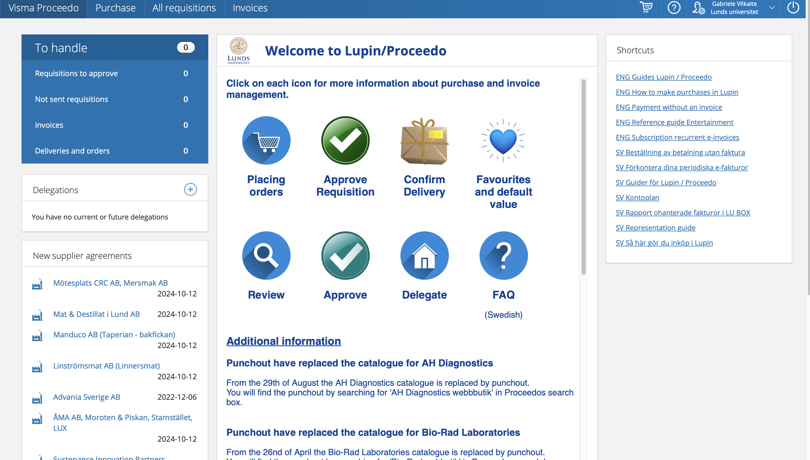
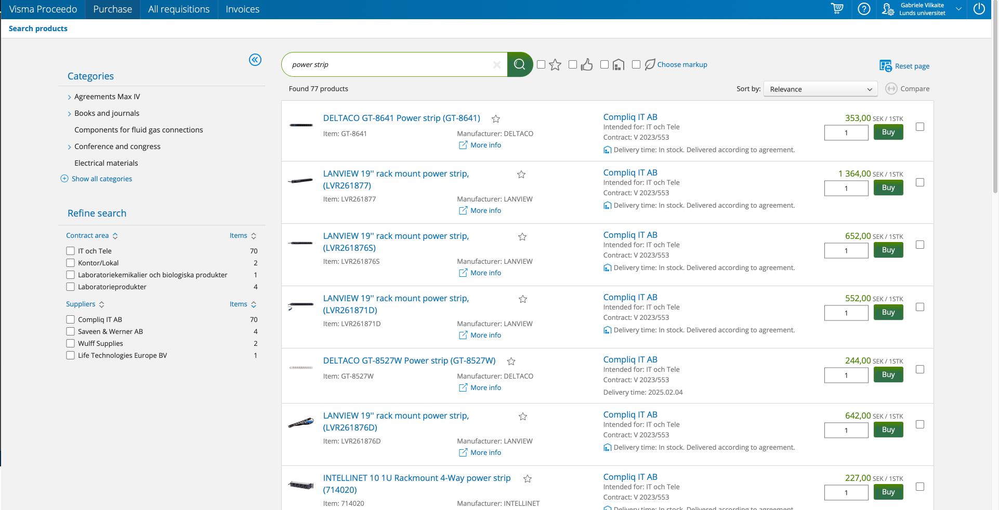
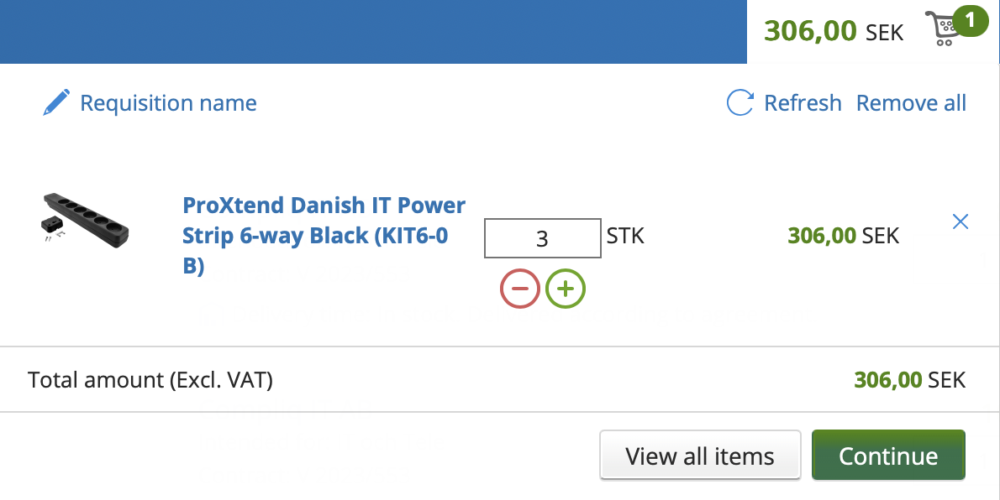
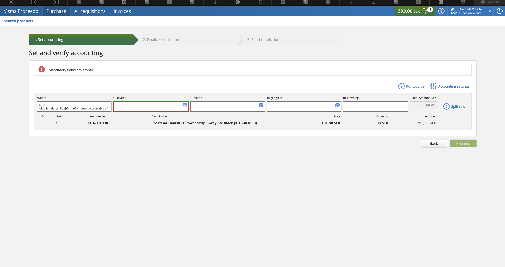
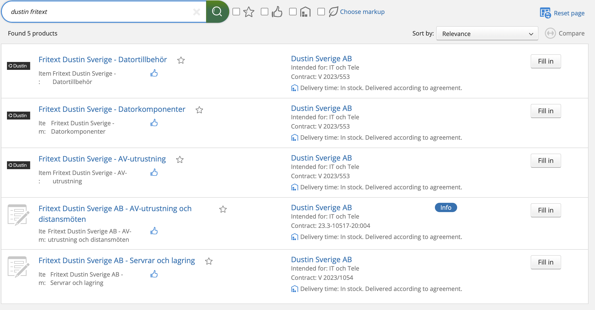
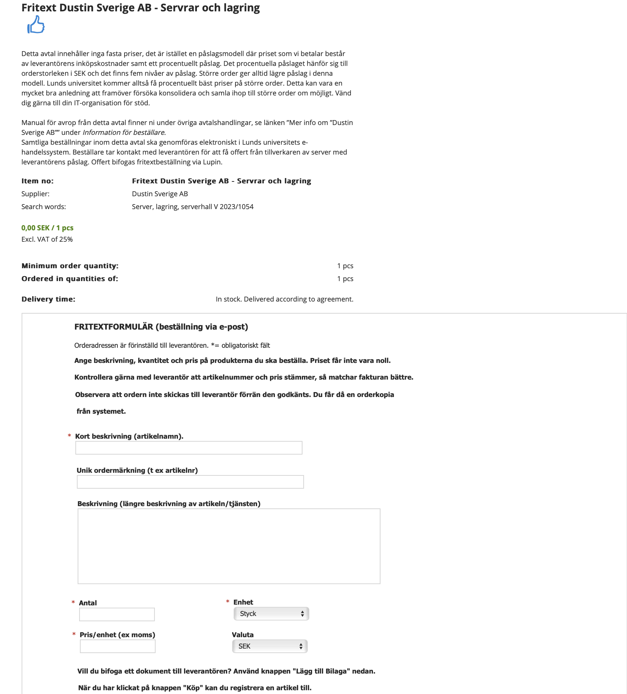
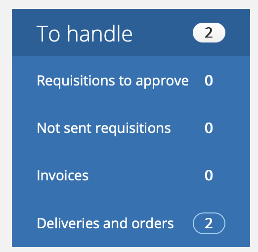
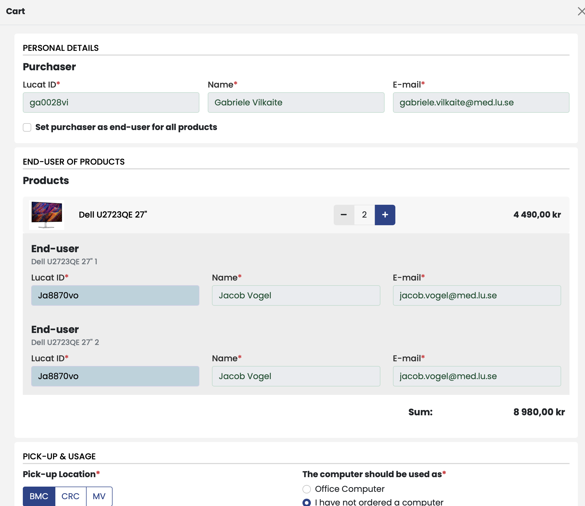

---
tags:
  - lab_maintenance
created:
  - 2024-Oct-25 09:38
aliases:
  - Git Wiki
---
# Lucat
You need an entitlement in Lucat in order to be able to login to Lupin (Proceedo). You can request the needed entitlement in Lucat by following these steps:
1. Go to lucat.lu.se in your web browser and login. 
2. Click on My entitlements under My page on the left hand side, and then click on Request an entitlement. 
3. Select the Type of entitlement as IT service. 
4. Select the following: 
	- IT service group: Ekonomi 
	- IT service: Lupin 
	- Entitlement: Basanvändare
	
5. Wait for the request to be processed. You can see the status of the request by refreshing the website and then clicking the "i" symbol to the right of the request. Once the request is approved and the systems have synchronized, you should be able to login to Lupin.

# Lupin/Proceedo
Lupin home page:

Each large icon leads to a page with information how to perform each task.

Purchase (top left) leads you to page where you can look for things to purchase, then just it up and purchase. Can find _almost_ everything, but there are few exceptional cases, which will be mentioned later.

## Purchasing

### 1. Find the goods
After searching what you need, just add the goods to the cart, and then press continue to check-out (classic online shopping moves).

### 2. Send the requisition

1. **Set accounting**

Aktivitet - grant code (just search Vogel, to find all Jake's grant codes)

2. **Finalize requisition**

Delivery address: __VERY IMPORTANT__
LUNDS UNIVERSITET, BMC GODSMOTTAGNING
Baravägen 22C
222 41 LUND
GLN: 7350032945439

### Free-form requisition
Sometimes you may need something _very specific_ that you just can't find in the normal Lupin store. In such a case you may need to find the item online and then request it to be purchased via freetext form.

#### Case:
Purchasing Data storage server, found a specific one we liked on Dustin webstore, but not in the Lupin system.

Looked up dustin fritext in the purchasing page

Choose the most fitting fritext option

Fill out the form with things such as the item name, catalog number, description, price etc.
And send in as a requisition.

## Invoices
Besides purchasing goods in Lupin/Proceedo site you may also get invoices to check and aprove that you can find in Invoices section.

In there once you get the invoice (for example for travel booking hotel, flights etc.) you will need to enter the activity code and accept the invoice.

# MED IT purchasing

Some of the more common things can be purchased much faster and without having to go through a Lupin/Proceedo hassle just via MED IT support page ([link](https://it.med.lu.se))

Cost Center : 314821 Neurodegenerativ - Vogel

Activity: Grant code, ask Jake which to use